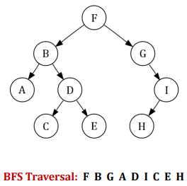
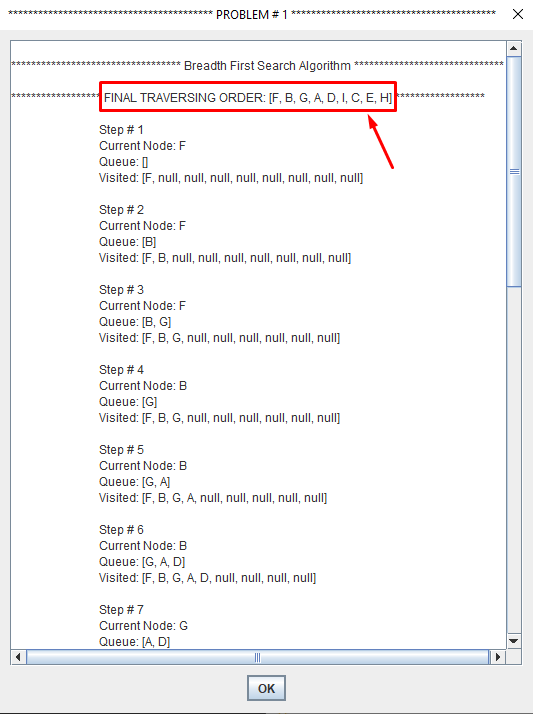
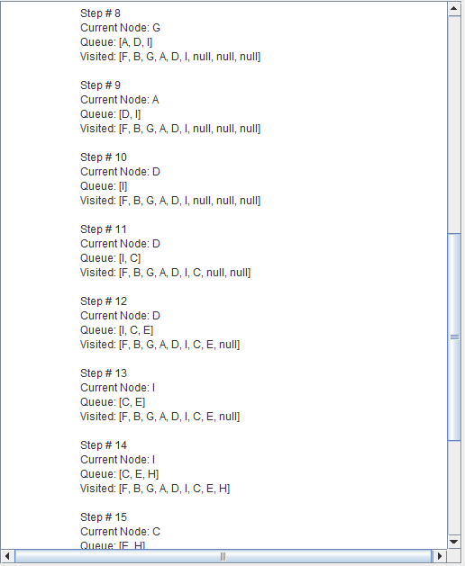
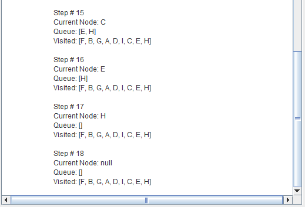

# Searching Algorithms of Aritificial Intelligence

Artificial Intelligence is the study of building agents that act rationally. Most of the time, these agents perform some kind of search algorithm in the background in order to achieve their tasks. 

The objective of search procedure is to discover a path through a problem
spaces from an initial configuration to a goal state.

The Solution to a search problem is a sequence of actions, called the plan that transforms the start state to the goal state.

This plan is achieved through search algorithms.
### Types of Searching Algorithms

### 1) Uninformed Search

Also called as Blind Search or Brute Force Search.

Suitable For very limited Problem Space problems.

A blind search is a search that has no information about its domain. The only thing
that a blind search can do is to distinguish a non-goal state from a goal state.

– Breadth-First search

– Depth-First search

– Uniform-Cost search

– Depth-First Iterative Deepening search

#### i) Breadth-First Search

Breadth-first search (BFS) is an algorithm for traversing or searching tree or
graph data structures.

It starts at the tree root and explores the neighbor nodes first, before moving
to the next level neighbors.

Breadth First Search explores the state space in a level by level fashion. Only
when there are no more states to be explored at a given level then the
algorithm move onto the next level.

#### Program Output

##### Problem # 1

  

  
  
  
  

##### Problem # 2

##### Problem # 3

##### Problem # 4

##### Problem # 5

  
