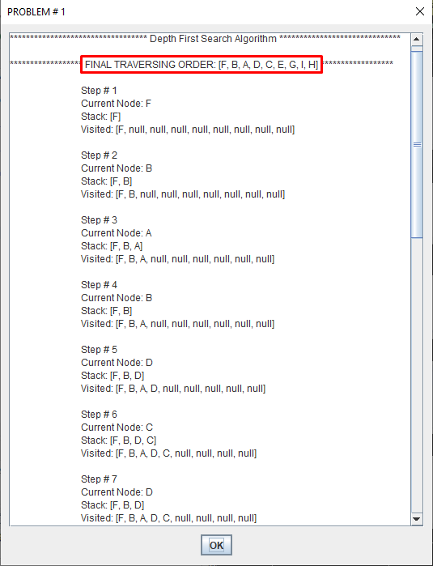
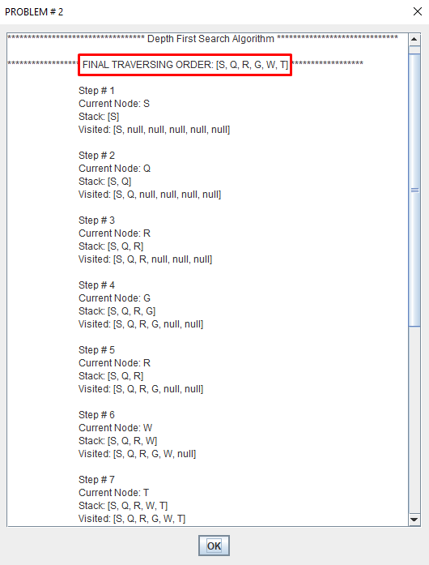
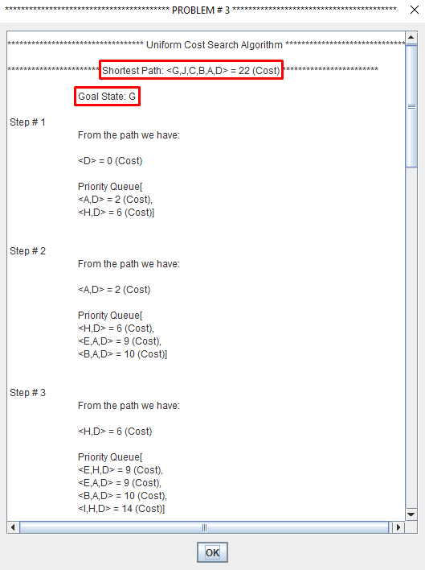

# Searching Algorithms of Aritificial Intelligence

Artificial Intelligence is the study of building agents that act rationally. Most of the time, these agents perform some kind of search algorithm in the background in order to achieve their tasks. 

The objective of search procedure is to discover a path through a problem
spaces from an initial configuration to a goal state.

The Solution to a search problem is a sequence of actions, called the plan that transforms the start state to the goal state.

This plan is achieved through search algorithms.
### Types of Searching Algorithms

### 1) Uninformed Search

Also called as Blind Search or Brute Force Search.

Suitable For very limited Problem Space problems.

A blind search is a search that has no information about its domain. The only thing
that a blind search can do is to distinguish a non-goal state from a goal state.

– Breadth-First search

– Depth-First search

– Uniform-Cost search

– Depth-First Iterative Deepening search

#### i) Breadth-First Search

Breadth-first search (BFS) is an algorithm for traversing or searching tree or
graph data structures.

It starts at the tree root and explores the neighbor nodes first, before moving
to the next level neighbors.

Breadth First Search explores the state space in a level by level fashion. Only
when there are no more states to be explored at a given level then the
algorithm move onto the next level.

BFS is complete. If there exists an answer, it will be found (b should be finite).

BFS is optimal (if cost = 1 per step). The path from initial state to goal state
is shallow.

Time & Space Complexity = s O(b^d)
Where "b" = Branch Factor (Number of nodes from root first expands on a set number of nodes, say b.)

& "d" = depth

<h2 align="center"> <u> Program Output </u> </h2> 
 
<h2 align="center"> BFS Problem # 1</h2>
  

  

  
  
  
  

<h2 align="center"> BFS Problem # 2</h2>

  
 

 
 

  
  

<h2 align="center"> BFS Problem # 3 </h2>

  
 

 
 

  
  
  
  

<h2 align="center"> BFS Problem # 4 </h2>

  
 

 
 

  
  
  
  

<h2 align="center"> BFS Problem # 5 </h2>

  
 

 
 

  
  
  
  
 

#### ii) Depth-First Search

Depth-first search (DFS) is an algorithm for traversing or searching tree or
graph data structures. One starts at the root and explores as far as possible
along each branch before backtracking.

A depth first search begins at the root node (i.e. Initial node) and works
downward to successively deeper levels.

An operator is applied to the node to generate the next deeper node in
sequence. This process continues until a solution is found or backtracking is
forced by reaching a dead end.

If you have deep search trees (or infinite – which is quite possible), DFS may end up
running off to infinity and may not be able to recover.

Thus DFS is neither optimal nor complete

Time & Space Complexity = s O(b^d) {In some cases, DFS can be faster than BFS because it does not expand all nodes at a level}

Where "b" = Branch Factor (Number of nodes from root first expands on a set number of nodes, say b.)

& "d" = depth

<h2 align="center"> <u> Program Output </u> </h2> 
 
<h2 align="center"> DFS Problem # 1</h2>
  

  

  
  
  
  

<h2 align="center"> DFS Problem # 2</h2>
  

  

  
  

<h2 align="center"> DFS Problem # 3</h2>
  

  

  
  
  
  

<h2 align="center"> DFS Problem # 4</h2>
  

  

  
  
  

<h2 align="center"> DFS Problem # 5</h2>
  

  

  
  
  
  

#### iii) Uniform-First Search

Breadth-first search finds the shallowest goal state, but this may not always be
the least-cost solution for a general path cost function.

Uniform cost search modifies the breadth-first strategy by always expanding
the lowest-cost node rather than the lowest-depth node.

It maintain a priority Queue.

<h2 align="center"> <u> Program Output </u> </h2> 
 
<h2 align="center"> UCS Problem # 1</h2>
  

  

  
  
  

<h2 align="center"> UCS Problem # 2</h2>
  

  

  

<h2 align="center"> UCS Problem # 3</h2>
  

  

  
  
  
  

