# Search Algorithms in Artificial Intelligence

## Table of Contents
* <a href = "#Overview_Head" > Overview </a> 

* <a href = "#Types_Head" > Types Of Searching Algorithms </a> 

* <a href = "#UI" > User Interface </a> 

* <a href = "#Problem_Head" > User Define Problem Assumption </a> 

* <a href = "#Uniform_Search_Head" > Uninformed Search </a> 

  * <a href = "#BFS_Head" > Breadth First Search Algorithm (BFS) </a>
    * <a href = "#po1" > Program Output </a> 
        * <a href = "#BFS_UDP" > User Define Problem </a>
          * <a href = "#BFS_UDP_P1"> Problem # 1 </a>
        * <a href = "#BFS_PDP"> Predefine Problems </a>
          * <a href = "#BFS_PDP_P1"> Problem # 1 </a>
          * <a href = "#BFS_PDP_P2"> Problem # 2 </a>
          * <a href = "#BFS_PDP_P3"> Problem # 3 </a>
          * <a href = "#BFS_PDP_P4"> Problem # 4 </a>
          * <a href = "#BFS_PDP_P5"> Problem # 5 </a>

  * <a href = "#DFS_Head" > Depth First Search Algorithm (DFS) </a>
    * <a href = "#po2" > Program Output </a> 
        * <a href = "#DFS_UDP" > User Define Problem </a>
          * <a href = "#DFS_UDP_P1"> Problem # 1 </a>
        * <a href = "#DFS_PDP"> Predefine Problems </a>
          * <a href = "#DFS_PDP_P1"> Problem # 1 </a>
          * <a href = "#DFS_PDP_P2"> Problem # 2 </a>
          * <a href = "#DFS_PDP_P3"> Problem # 3 </a>
          * <a href = "#DFS_PDP_P4"> Problem # 4 </a>
          * <a href = "#DFS_PDP_P5"> Problem # 5 </a>
          
  * <a href = "#DLS_Head" > Depth Limited Search Algorithm (DLS)</a>
    * <a href = "#po3" > Program Output </a> 
        * <a href = "#DLS_UDP" > User Define Problem </a>
          * <a href = "#DLS_UDP_P1"> Problem # 1 </a>
        * <a href = "#DLS_PDP"> Predefine Problems </a>
          * <a href = "#DLS_PDP_P1"> Problem # 1 </a>
          * <a href = "#DLS_PDP_P2"> Problem # 2 </a>
         
  * <a href = "#UCS_Head" > Uniform Cost Search Algorithm (UCS)</a>
    * <a href = "#po4" > Program Output </a> 
        * <a href = "#UCS_UDP" > User Define Problem </a>
          * <a href = "#UCS_UDP_P1"> Problem # 1 </a>
        * <a href = "#UCS_PDP"> Predefine Problems </a>
          * <a href = "#UCS_PDP_P1"> Problem # 1 </a>
          * <a href = "#UCS_PDP_P2"> Problem # 2 </a>
          * <a href = "#UCS_PDP_P3"> Problem # 3 </a>

* <a href = "#Inform_Search_Head" > Informed Search </a> 

  * <a href = "#GBFS_Head" > Greedy Best First Search Algorithm (GBFS)</a>
    * <a href = "#po5" > Program Output </a> 
        * <a href = "#GBFS_UDP" > User Define Problem </a>
          * <a href = "#GBFS_UDP_P1"> Problem # 1 </a>
        * <a href = "#GBFS_PDP"> Predefine Problems </a>
          * <a href = "#GBFS_PDP_P1"> Problem # 1 </a>
          * <a href = "#GBFS_PDP_P2"> Problem # 2 </a>
          
          
  * <a href = "#ASS_Head" > A* Search Algorithm (ASS) </a>
    * <a href = "#po6" > Program Output </a> 
        * <a href = "#ASS_UDP" > User Define Problem </a>
          * <a href = "#ASS_UDP_P1"> Problem # 1 </a>
        * <a href = "#ASS_PDP"> Predefine Problems </a>
          * <a href = "#ASS_PDP_P1"> Problem # 1 </a>
          * <a href = "#ASS_PDP_P2"> Problem # 2 </a>
        
* <a href = "#Comparision_Head" > Comaprisions of All Algorithms </a> 

## 
 Overview 

Artificial Intelligence is the study of building agents that act rationally. Most of the time, these agents perform some kind of search algorithm in the background in order to achieve their tasks. 

The objective of search procedure is to discover a path through a problem
spaces from an initial configuration to a goal state.

The Solution to a search problem is a sequence of actions, called the plan that transforms the start state to the goal state.

This plan is achieved through search algorithms.
     
## 
  Types of Searching Algorithms 

## 
 User Define Problem Assumption 

 

 Assume that above Graph will be used by User. 

## 
  User Interface 

 

 
 

  <figcaption align = "center"> Fig-A: Selecting Algorithm </figcaption>
 

 
 

  
 

 
 

  <figcaption align = "center"> Fig-B: Selecting BFS and Defining the Graph </figcaption>
 

 
 

  
 

 
 

  <figcaption align = "center"> Fig-C: Selecting DFS and Defining the Graph </figcaption>
 

 
 

  
 

 
 

  <figcaption align = "center"> Fig-D: Selecting DLS and Defining the Graph </figcaption>
 

 
 

  
 

 
 

  <figcaption align = "center">  Fig-E: Selecting UCS and Defining the Graph  </figcaption>
 

## 
 1) Uninformed Search </d>

Also called as Blind Search or Brute Force Search.

Suitable For very limited Problem Space problems.

A blind search is a search that has no information about its domain. The only thing
that a blind search can do is to distinguish a non-goal state from a goal state.

– Breadth-First search

– Depth-First search

– Uniform-Cost search

– Depth-First Iterative Deepening search

### 
 i) Breadth-First Search 

Breadth-first search (BFS) is an algorithm for traversing or searching tree or
graph data structures.

It starts at the tree root and explores the neighbor nodes first, before moving
to the next level neighbors.

Breadth First Search explores the state space in a level by level fashion. Only
when there are no more states to be explored at a given level then the
algorithm move onto the next level.

BFS is complete. If there exists an answer, it will be found (b should be finite).

BFS is optimal (if cost = 1 per step). The path from initial state to goal state
is shallow.

Time & Space Complexity = s O(b^d)
Where "b" = Branch Factor (Number of nodes from root first expands on a set number of nodes, say b.)

& "d" = depth

<h2 align="center" id = "po1"> <u> Program Output </u> </h2> 

## 
 User Define Problem 

### 
 Problem # 1

#### 
 Traversing 

  
 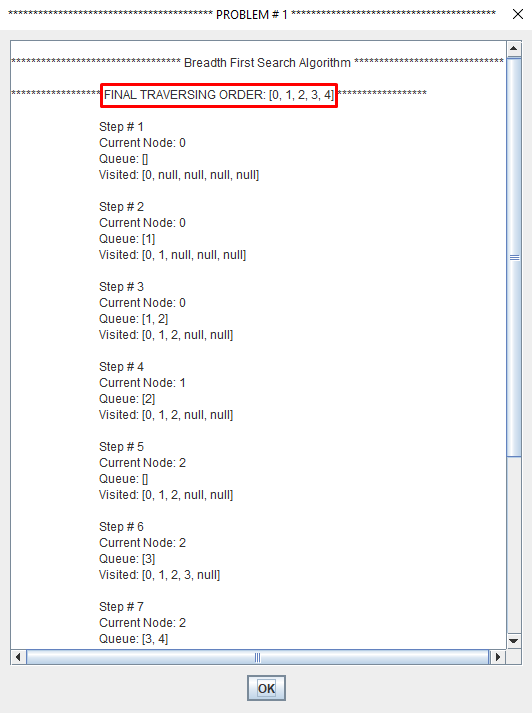
  

#### 
 Searching 

  
  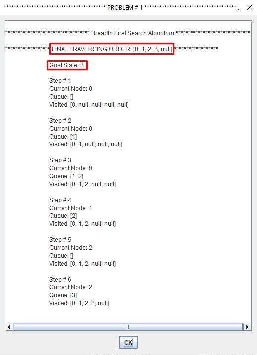

## 
 Pre Define Problems 

  

<h2 align="center" id = "BFS_PDP_P1"> BFS Example Problem # 1</h2>
  

  

  
  
  

<h2 align="center"  id = "BFS_PDP_P2" > BFS Problem # 2</h2>

  
 

 
 

  
  

<h2 align="center"  id = "BFS_PDP_P3"> BFS Problem # 3 </h2>

  
 

 
 

  
  
  
  

<h2 align="center"  id = "BFS_PDP_P4"> BFS Problem # 4 </h2>

  
 

 
 

  
  
  
  

<h2 align="center"  id = "BFS_PDP_P5"> BFS Problem # 5 </h2>

  
 

 
 

  
  
  
  
 

### 
 ii) Depth-First Search 

Depth-first search (DFS) is an algorithm for traversing or searching tree or
graph data structures. One starts at the root and explores as far as possible
along each branch before backtracking.

A depth first search begins at the root node (i.e. Initial node) and works
downward to successively deeper levels.

An operator is applied to the node to generate the next deeper node in
sequence. This process continues until a solution is found or backtracking is
forced by reaching a dead end.

If you have deep search trees (or infinite – which is quite possible), DFS may end up
running off to infinity and may not be able to recover.

Thus DFS is neither optimal nor complete

Time & Space Complexity = s O(b^d) {In some cases, DFS can be faster than BFS because it does not expand all nodes at a level}

Where "b" = Branch Factor (Number of nodes from root first expands on a set number of nodes, say b.)

& "d" = depth

<h2 align="center" id = "po2"> <u> Program Output </u> </h2> 

## 
 User Define Problem 

### 
 Problem # 1

#### 
 Traversing 

  
  
  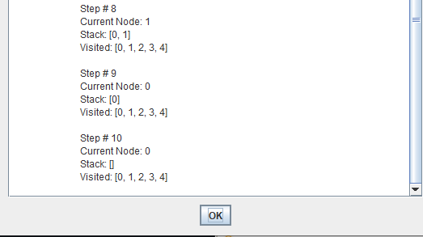

#### 
 Searching 

  
  

 ## 
 Pre Define Problem 

  

<h2 align="center" id = "DFS_PDP_P1"> DFS Example Problem # 1</h2>
  

  

  
  
  
  

<h2 align="center" id = "DFS_PDP_P2"> DFS Example Problem # 2</h2>
  

  

  
  

<h2 align="center" id = "DFS_PDP_P3"> DFS Example Problem # 3</h2>
  

  

  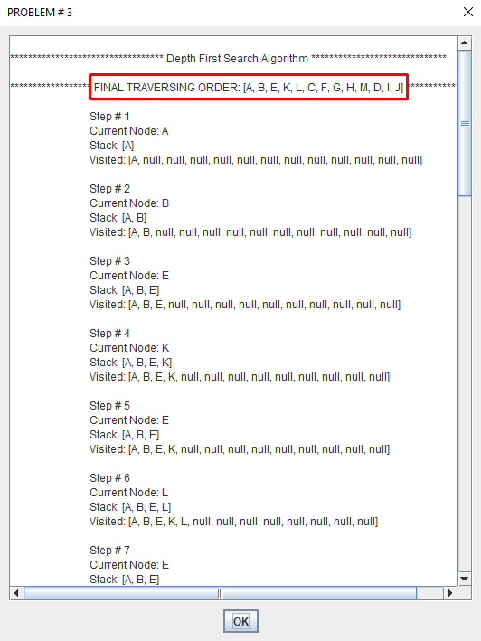
  
  
  

<h2 align="center" id = "DFS_PDP_P4"> DFS Example Problem # 4</h2>
  

  

  
  
  

 
<h2 align="center" id = "DFS_PDP_P5"> DFS Example Problem # 5</h2>
  

  

  
  
  
  

### 
 iii) Depth-Limited Search 

Depth-first search will not find a goal if it searches down a path that has
infinite length. So, in general, depth-first search is not guaranteed to find a
solution, so it is not complete.

This problem is eliminated by limiting the depth of the search to some value l.
However, this introduces another way of preventing depth-first search from
finding the goal: if the goal is deeper than l it will not be found.

Regular depth-first search is a special case, for which l=∞.

Depth limited search is complete but not optimal.

If we choose a depth limit that is too small, then depth limited search is not
even complete.

The time and space complexity of depth limited search is similar to depth first
search.

<h2 align="center" id = "po3" > <u> Program Output </u> </h2> 
 
## 
 User Define Problem 

### 
 Problem # 1

#### 
 Traversing 
 

  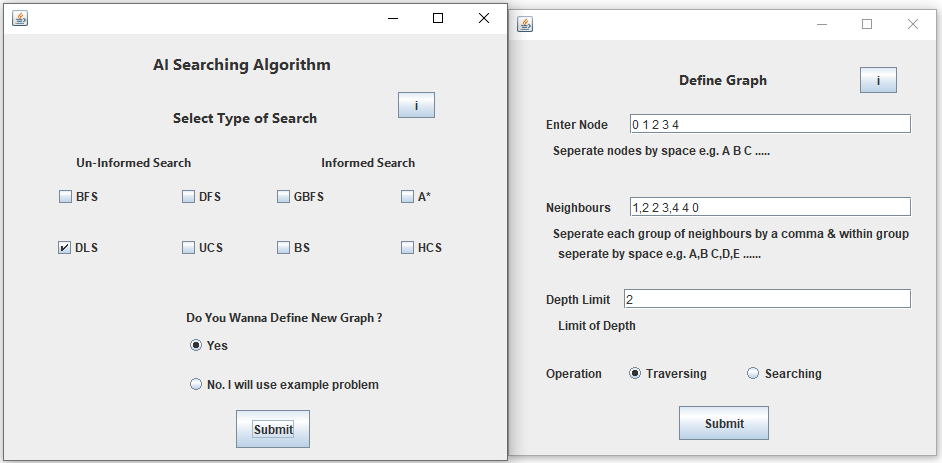
  

 

#### 
 Searching 
 

  
  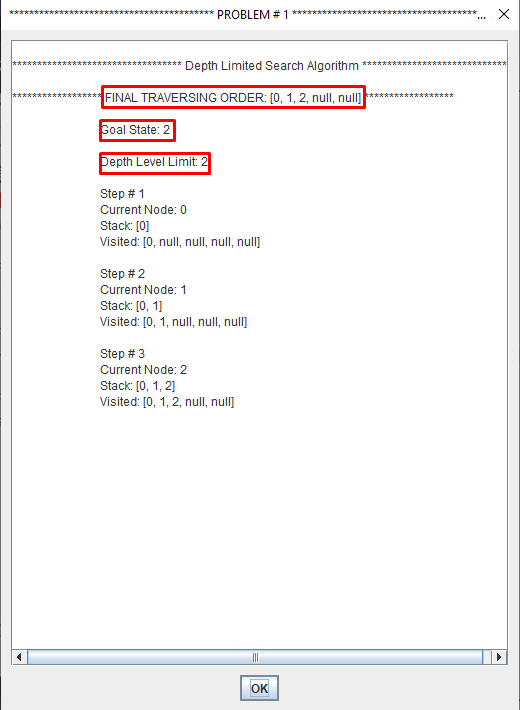

 

## 
 Pre Define Problem 

  

<h2 align="center" id = "DLS_PDP_P1"> DLS Problem # 1</h2>
  

  

  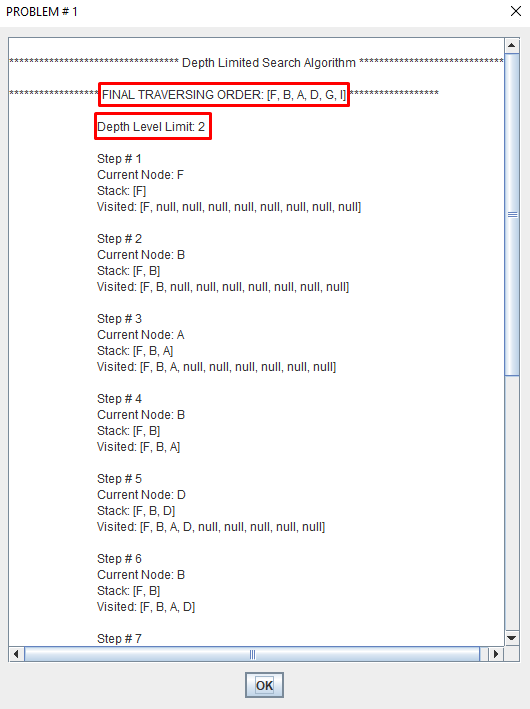
  

<h2 align="center" id = "DLS_PDP_P2"> DLS Problem # 2</h2>
  

  

  
  

### 
 iii) Uniform-Cost Search

Breadth-first search finds the shallowest goal state, but this may not always be
the least-cost solution for a general path cost function.

Uniform cost search modifies the breadth-first strategy by always expanding
the lowest-cost node rather than the lowest-depth node.

It maintain a "Priority Queue".

<h2 align="center" id = "po4" > <u> Program Output </u> </h2> 

## 
 User Define Problem 

### 
 Problem # 1

#### 
 Searching 
  
 

  
  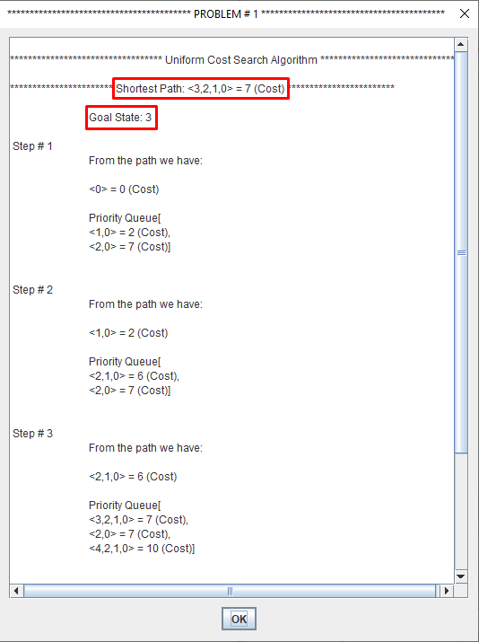
   

 
 ## 
 Pre Define Problem 

 
 

  

 
<h2 align="center" id = "UCS_PDP_P1"> UCS Problem # 1</h2>
  

  

  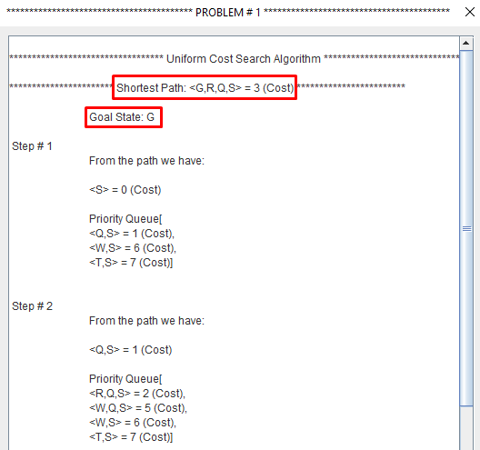
  
  

<h2 align="center" id = "UCS_PDP_P2"> UCS Problem # 2</h2>
  

  

  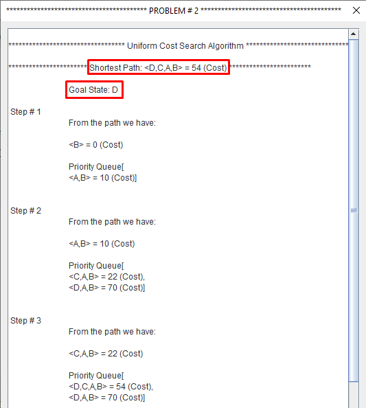
  

<h2 align="center" id = "UCS_PDP_P3"> UCS Problem # 3</h2>
  

  

  
  
  
  

## 
 2) Informed Search </d>

Uninformed search strategies can find solutions to problems by systematically
generating new states and testing them against the goal.

Unfortunately, these strategies are incredibly inefficient in most cases.

Uninformed search uses problem-specific knowledge—can find solutions more
efficiently.

Heuristics are "rules of thumb", educated guesses, intuitive judgments or
simply common sense.

A heuristic function, h(n), provides an estimate of the cost of the path from a
given node to the closest goal state.

Must be zero if node represents a goal state.

– Greedy-Best-First search

– A * search

### 
 i) Greedy-Best-First Search 

Depth first search is good because it allows a solution to be found without all
competing branches to be expanded.

Breadth first search is good because it does not get trapped on dead-end paths.

Best First Search combines the advantages of the two.

At each step of the best first search process, we select the most promising of
the nodes we have generated so far.

This is done by applying an appropriate heuristic function to each of them.

**Greedy Best-First search tries to expand the node that is closest to the goal
assuming it will lead to a solution quickly.**

  * f(n) = h(n)

  * f(n) = Function that gives an evaluation of the state.

  * h(n) = The cost of getting from the current state to a goal state.

#### 
 Features 

The Greedy Best-First-Search algorithm works as uniform cost search, except that it
has some estimate (called a heuristic) of how far from the goal any node is.

Instead of selecting the node closest to the starting point, it selects the node closest to the goal.

Greedy Best-First-Search is not guaranteed to find a shortest path.

However, it runs much quicker than uniform cost search algorithm because it uses the heuristic function to guide its way towards the goal very quickly

<h2 align="center" id = "po5"> <u> Program Output </u> </h2> 

## 
 User Define Problem 

### 
 Problem # 1

#### 
 Searching 

 
  
 

## 
 Pre Define Problems 

  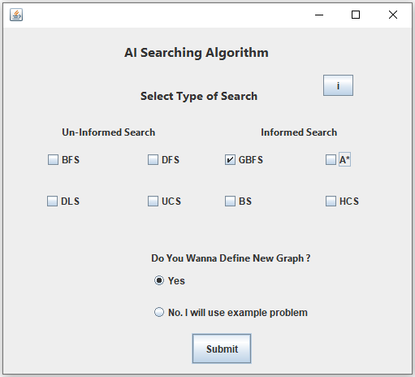

<h2 align="center" id = "GBFS_PDP_P1"> GBFS Example Problem # 1</h2>
  

  

  
  

<h2 align="center" id = "GBFS_PDP_P2"> GBFS Example Problem # 2</h2>

  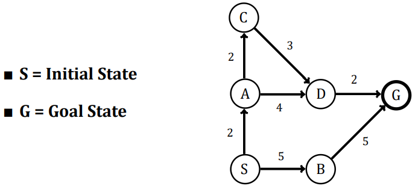

  
  

### 
 i) A* Search 

Greedy Search minimizes a heuristic h(n) which is an estimated cost from a
node n to the goal state. However, although greedy search can considerably cut
the search time (efficient), it is neither optimal nor complete.

Uniform Cost Search minimizes the cost g(n) from the initial state to n. UCS is
optimal and complete but not efficient

** New Strategy: Combine Greedy Search and UCS to get an efficient algorithm
which is complete and optimal. **

  A search algorithm to find the shortest path through a search space to a goal
state using a heuristic.
 * f(n) = g(n) + h(n)
* f(n) = Function that gives an evaluation of the state.
* g(n) = The cost of getting from the initial state to the current state.
* h(n) = The cost of getting from the current state to a goal state.

#### 
 Features 

It is Efficient.

It is complete.

It is Optimal.

<h2 align="center" id = "po6"> <u> Program Output </u> </h2> 

## 
 User Define Problem 

### 
 Problem # 1

#### 
 Searching 

 
  
  
  
 

## 
 Pre Define Problems 

  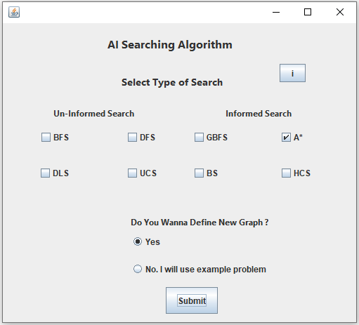

<h2 align="center" id = "ASS_PDP_P1"> ASS Example Problem # 1</h2>
  

  

  
  
  

<h2 align="center" id = "ASS_PDP_P2"> ASS Example Problem # 2</h2>
  

  

  
  
  

## 
 Comparisions of All Algorithms </d>

  

